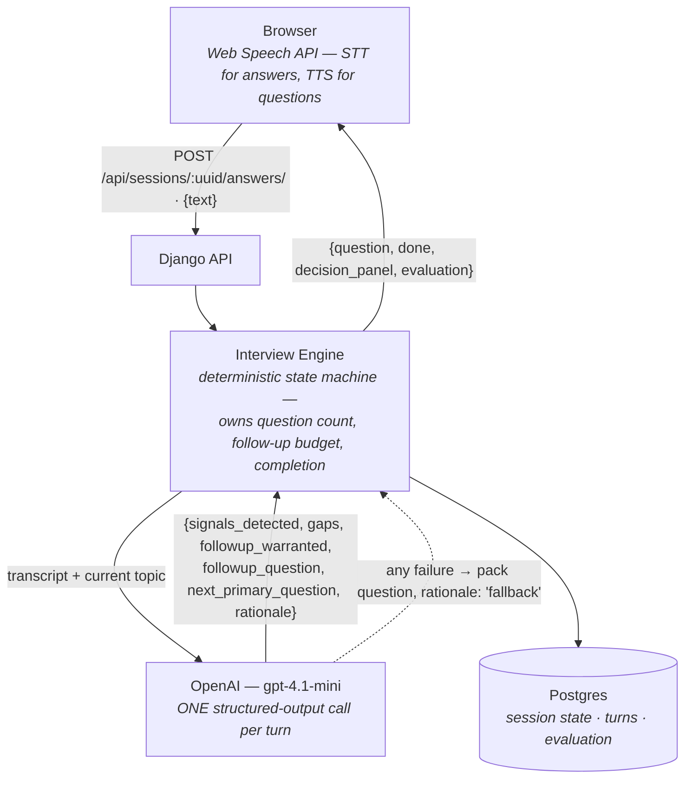

# AI Voice Interviewer

A lightweight web app where candidates pick a job, enter an interview room, and complete a voice-driven interview with an AI interviewer that adapts its questions to what they say. Every session is saved with a full transcript, a live "decision panel" showing the interviewer's reasoning, and a structured final evaluation.

**[Live demo](https://ai-interviewer-i6bx.onrender.com)** — free-tier hosting, allow ~1 minute for cold start after idle.

## Features

| Requirement | Implementation |
|---|---|
| ≥ 3 sample jobs | 3 seeded roles (title + description), each with its own question pack |
| Voice input | Voice-only answers: push-to-talk microphone via the Web Speech API, spoken questions (speech synthesis), live transcript display |
| ≥ 6 questions, ≥ 2 adaptive follow-ups | Exactly 7 interviewer questions per session: 5 primary + 2 follow-ups grounded in the candidate's prior answers |
| Role-grounded | Questions come from the selected job's pack and are templated/followed up with the job title and description in context |
| Saved session + transcript | Every Q/A turn persisted to Postgres; results page shows the full transcript |
| Structured evaluation | JSON evaluation on completion: `strengths`, `concerns`, `overall_score` (1–10), `summary` |
| Stretch 1 — decision panel | Live panel in the room: skills detected (with evidence), gaps, topics covered, follow-ups used, and *why* the next question was chosen |
| Stretch 2 — question packs | Per-role structured banks (behavioral + technical categories); the engine selects from them and generates targeted follow-ups |
| Stretch 3 — video mode | Call-style layout: AI interviewer tile with a speaking animation synced to TTS, plus an optional mirrored camera self-view (off by default; the interview never depends on it) |
| Stretch 4 — session history | `/sessions/` page: past interviews filterable by role, with per-session metrics (questions, follow-ups, duration, talk ratio, score) linking to full transcript replay |

## Architecture

The core design decision: **a deterministic engine owns control flow; the LLM only supplies content.** The interview can never stall, loop, or run long because the LLM is never asked "what should happen next?" — only "what should be said next?"



- **Question policy**: each role's pack has 5 topics. A session is exactly 7 interviewer questions — 5 primary + 2 follow-ups. Question 1 is templated from the pack with the job title (no LLM call). After each answer, the engine takes a follow-up if the LLM flags one as warranted (and the budget of 2 isn't spent), otherwise advances to the next primary topic; the budget is force-spent near the end so every interview gets its 2 follow-ups.
- **One structured-output call per turn**: analysis of the answer and generation of the next question happen in a single OpenAI call with a strict JSON schema — half the latency and no drift between "what was detected" and "what gets asked".
- **Fallback resilience**: if the LLM call fails (timeout, quota, bad key), the engine serves the next pack question verbatim with `rationale: "fallback"`. The interview always completes and the transcript is always saved.
- **Decision panel**: the same per-turn structured output (signals, gaps, coverage, rationale) is returned to the client and rendered live — the deterministic state *is* the UI.

Deeper diagrams live in [`docs/`](docs/): [architecture](docs/architecture.md), [application flow](docs/application-flow.md), [database model](docs/database-model.md).

## Tech stack

- **Backend**: Django 6 / Python 3.14, PostgreSQL, Gunicorn (gthread) + WhiteNoise
- **LLM**: OpenAI `gpt-4.1-mini` via structured outputs (Pydantic schemas)
- **Frontend**: Django templates + vanilla JS, Web Speech API (SpeechRecognition + SpeechSynthesis)
- **Infra**: Docker, docker-compose for local dev, Render (Blueprint) for hosting

## Local development

```bash
cp .env.example .env         # then set OPENAI_API_KEY in .env
docker compose up --build
docker compose exec web python manage.py migrate
docker compose exec web python manage.py seed_jobs
```

Open http://localhost:8000. Without an `OPENAI_API_KEY` the app still runs end-to-end using the deterministic fallback (pack questions verbatim, generic follow-ups).

**Tests**

```bash
docker compose exec web python manage.py test
```

## Deploy to Render

This repo ships a [Blueprint](https://render.com/docs/blueprint-spec) (`render.yaml`) that provisions the web service (Docker) and a free Postgres database, wires `DATABASE_URL`, generates `SECRET_KEY`, and sets host/CSRF config — migrations and job seeding run automatically on boot via `entrypoint.sh`.

1. Push this repo to GitHub (already done if you're reading this there).
2. In the Render dashboard: **New → Blueprint**, connect and select this repository.
3. Render reads `render.yaml` and shows the plan. When prompted, paste your **`OPENAI_API_KEY`** (the only value not in the Blueprint).
4. Click **Apply**. First build takes a few minutes; the app is live at `https://<service-name>.onrender.com`.

No post-deploy configuration is needed: `ALLOWED_HOSTS` is set to `.onrender.com` and `CSRF_TRUSTED_ORIGINS` to `https://*.onrender.com` in the Blueprint, so any assigned Render subdomain works out of the box.

**Free-tier notes**: the web service spins down after ~15 minutes of inactivity (first request after idle takes ~1 minute), and Render's free Postgres instance expires after its free period — fine for reviewing this take-home.

## Testing

Automated engine/API tests: `docker compose exec web python manage.py test`.
Manual voice/camera/browser verification: see [E2E_TEST_PLAN.md](E2E_TEST_PLAN.md).

## Notes & tradeoffs

- **Browser support**: answers are voice-only by design. Voice recognition uses the Web Speech API, which requires **Chrome/Edge on desktop** with microphone access allowed — the app states this explicitly if the browser or mic is unavailable.
- **Push-to-talk over open mic**: an explicit talk button gives a clean turn boundary (no VAD tuning, no cut-off answers, no accidental captures) — the right friction/robustness tradeoff for an interview where turns are naturally discrete.
- **Browser STT/TTS over server-side audio**: keeps latency low and the stack simple (no audio upload, no streaming infra) at the cost of browser dependence — the fallback covers the gap.

## Future improvements

- **Fully hands-free conversation** — remove the last button. Today the mic auto-opens after each question is read; the next step is silence-based endpointing so the answer auto-submits after ~2s of sustained silence (voice-activity detection via the Web Audio API on the mic stream, since `SpeechRecognition` alone can't distinguish "thinking pause" from "done"). The interview then flows like a real call: question → answer → next question, zero clicks. Needs careful tuning — submitting mid-thought is worse than one extra click — so it would ship with the silence threshold user-adjustable and the stop button kept as an override.
- **Barge-in** — let the candidate start talking over the question to interrupt TTS (cancel speech, open the mic), like interrupting a human interviewer.
- **Natural streaming voice** — replace browser `speechSynthesis` with a streaming TTS API (e.g. OpenAI audio) for a far more natural interviewer voice, streamed sentence-by-sentence to keep latency low.
- **Server-side STT (Whisper)** — record audio in the browser and transcribe server-side to lift the Chrome/Edge-only restriction and improve transcription quality on accents and technical vocabulary.
- **Analytics over history** — score trends per role across sessions, topic-coverage heatmaps, and answer-length/talk-ratio evolution, building on the metrics the history page already computes.
- **Accounts & multi-language** — per-user session history behind auth, and interviews conducted in the candidate's language (both STT/TTS and prompts are language-parameterizable).
