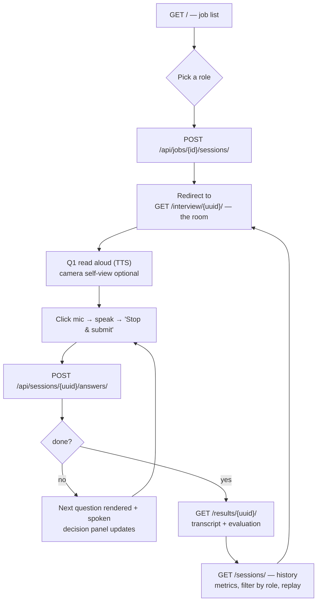
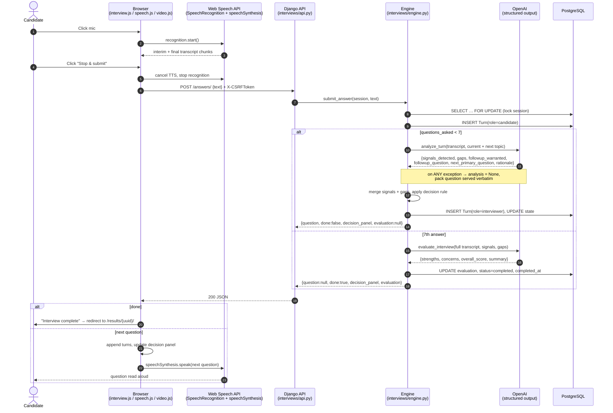
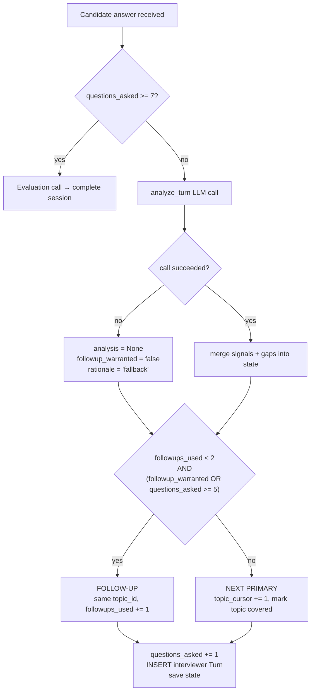
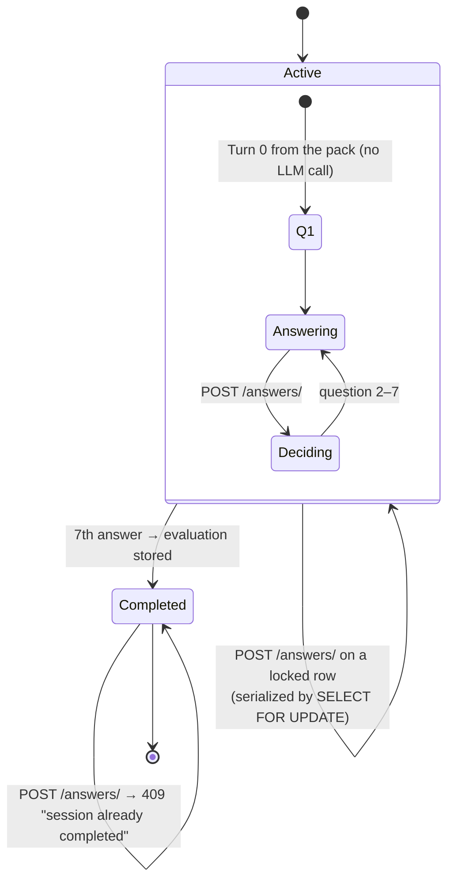
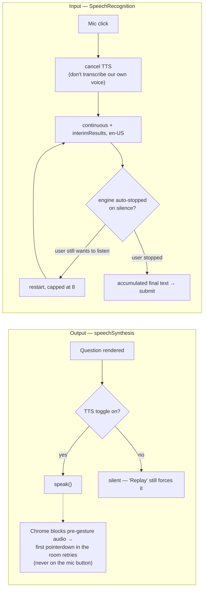

# Application Flow

How one interview runs, end to end: the browser drives voice, the server owns
every decision. Policy source of truth is `interviews/engine.py`; the wire
format is [CONTRACT.md](../CONTRACT.md).

## 1. User journey

## 2. One answer, end to end

The core loop. Everything between "Stop & submit" and the next spoken question
is a single round trip.

## 3. The decision rule

Deterministic, in Python. The model proposes; the engine disposes — it never
decides how many questions to ask or when to stop.

Constants live in `engine.py`: `TOTAL_QUESTIONS = 7`, `MAX_FOLLOWUPS = 2`,
`FORCE_FOLLOWUP_AT = 5`.

Why every interview is exactly 5 primaries + 2 follow-ups:

- `MAX_FOLLOWUPS = 2` caps the top end — a chatty model can't run long.
- `FORCE_FOLLOWUP_AT = 5` covers the bottom end: once 5 questions have been
  asked, any remaining follow-up budget is spent. A model that never asks for
  a follow-up still produces two.

## 4. Session state machine

Refreshing the room mid-interview is safe: `GET /api/sessions/<uuid>/` rebuilds
the transcript, and the decision panel's covered-topics and follow-up count are
re-derived from interviewer `Turn.meta` (`derivePanelFromTurns`).

## 5. Voice path in the browser

Voice is the only input path. No mic or no Web Speech API means the interview
cannot proceed, and the room says so explicitly rather than silently degrading.

`video.js` is presentational only: it polls `speechSynthesis.speaking` every
250 ms to animate the interviewer tile, and manages an optional
`getUserMedia({video: true, audio: false})` self-view. Camera audio stays off —
the mic belongs to speech recognition — and a camera failure never blocks the
interview.

## 6. Failure handling

| Failure | Behavior |
|---|---|
| `analyze_turn` raises (no key, timeout, refusal, schema mismatch) | Logged at WARNING; next pack question served verbatim with `rationale: "fallback"`. The interview always completes. |
| `evaluate_interview` raises | `FALLBACK_EVALUATION` stored (`overall_score: 0`); session still marked `completed`. |
| Answer POST fails in the browser | Transcript is restored into the answer box — the candidate's words are never lost — and "Send answer" retries. |
| POST to a completed session | `409`; the browser redirects to `/results/{uuid}/`. |
| Answer body empty/malformed | `400 {"error": "text is required"}`. |
| Unknown session or job id | `404`. |
| No `SpeechRecognition` support or mic denied | Controls disabled with an explicit "voice-only, use Chrome or Edge" message. |
| Camera denied | Self-view stays a placeholder; interview continues. |
