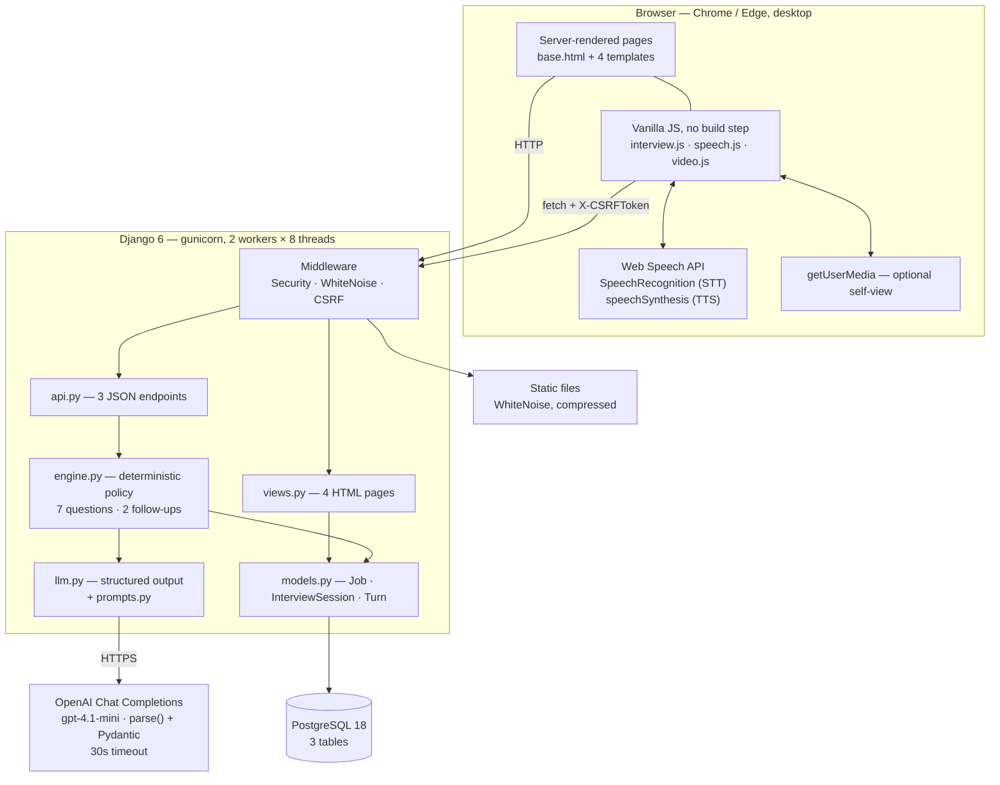
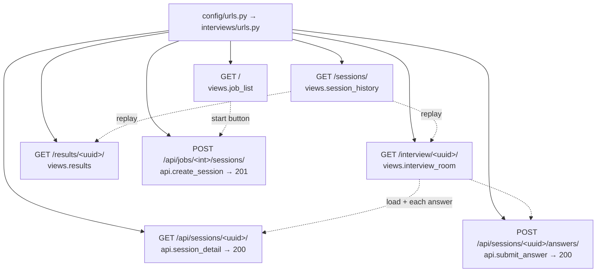
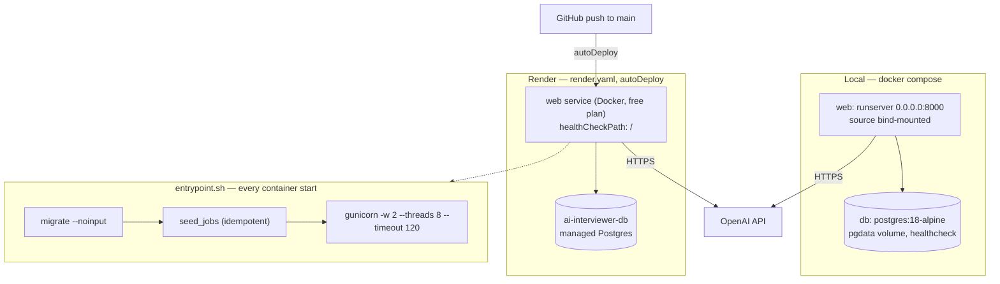

# Architecture

A deliberately small stack: one Django process, one Postgres database, one
external API. No queue, no cache, no WebSocket, no frontend build step. Every
piece below earns its place; the notes at the end say what was left out and why.

## System context

## Layers and responsibilities

Each layer has exactly one job, and the boundaries are enforced by where errors
are allowed to escape.

```mermaid
flowchart LR
    subgraph L1["Transport — api.py"]
        direction TB
        A1["Method + CSRF enforcement"]
        A2["Parse/validate body → 400"]
        A3["Look up session → 404"]
        A4["Completed session → 409"]
        A5["Serialize the contract shape"]
    end

    subgraph L2["Policy — engine.py"]
        direction TB
        B1["Owns ALL control flow:<br/>question count, follow-up budget,<br/>topic cursor, completion"]
        B2["Merges signals + gaps into state"]
        B3["Catches every LLM exception<br/>→ pack fallback"]
        B4["Transactional + row-locked"]
    end

    subgraph L3["Model access — llm.py + prompts.py"]
        direction TB
        C1["Builds messages"]
        C2["Pydantic schemas:<br/>TurnAnalysis · Evaluation"]
        C3["RAISES on everything —<br/>owns no fallback behavior"]
    end

    subgraph L4["Persistence — models.py"]
        direction TB
        D1["3 tables, JSON for<br/>everything that evolves"]
    end

    L1 --> L2 --> L3
    L2 --> L4
```

The key line is `llm.py` raising on *every* failure — missing key, network,
timeout, refusal, schema mismatch — while `engine.py` is the only place that
decides what a failure means. That is why an interview always finishes, with or
without the model.

### Why the LLM never controls flow

The model returns *content* — signals, gaps, a suggested follow-up, a phrasing
for the next primary — and a boolean *recommendation* (`followup_warranted`).
The engine reads that recommendation but bounds it with `MAX_FOLLOWUPS` and
`FORCE_FOLLOWUP_AT`, so interview length, structure, and cost are fixed no
matter what comes back. A hallucinating or unavailable model degrades question
quality; it can never produce a 3-question or 40-question interview.

## Request routing

Pages are server-rendered Django templates; the JSON API exists only for the
interview loop. There is no SPA router and no client-side state store — a
refresh re-reads the session from the server.

## Deployment topology

### Runtime shape

| Concern | Choice | Rationale |
|---|---|---|
| Image | `python:3.14-slim`, non-root `appuser`, `collectstatic` at build | Small, reproducible, no root at runtime |
| Server | gunicorn, 2 workers × 8 gthreads, 120s timeout | Requests are I/O-bound on a ≤30s OpenAI call; threads beat processes here, and the timeout comfortably exceeds it |
| Static | WhiteNoise, compressed storage | No CDN or bucket needed for a handful of CSS/JS files |
| DB config | `dj_database_url`, `conn_max_age=60` | One `DATABASE_URL` works locally and on Render; connection reuse without a pooler |
| TLS | `SECURE_PROXY_SSL_HEADER = X-Forwarded-Proto` | Render terminates TLS at its proxy |
| Boot | migrate + seed in `entrypoint.sh` | A fresh database is demo-ready with zero manual steps |

### Configuration

All via environment (`.env` locally, Render env vars in production):
`SECRET_KEY`, `DEBUG`, `ALLOWED_HOSTS`, `CSRF_TRUSTED_ORIGINS`, `DATABASE_URL`,
`OPENAI_API_KEY` (`sync: false` — never in the repo), `OPENAI_MODEL`.

## Security posture

- **CSRF**: standard `CsrfViewMiddleware`. The room template emits
  `<meta name="csrf-token">`; JS sends `X-CSRFToken` on every POST.
  `CSRF_TRUSTED_ORIGINS` covers the Render domain.
- **Unguessable session URLs**: UUID primary keys, so `/interview/<uuid>/` and
  `/results/<uuid>/` can't be walked.
- **No auth**: intentional for a demo. Anyone with a session URL can view it —
  the first thing to add for real use.
- **Secrets**: only from the environment; `OPENAI_API_KEY` is never committed
  and is marked `sync: false` in `render.yaml`.
- **Server-side policy**: the browser can't extend an interview, skip topics,
  or alter the evaluation. It POSTs text and renders what comes back.

## Concurrency

`engine.submit_answer` is wrapped in `@transaction.atomic` and re-reads the
session with `select_for_update()`. Two answers submitted simultaneously for the
same session serialize on the row: the first advances the state, the second
either advances correctly from the new state or hits the completed check and
gets a `409`. Turn indexes stay dense and unique — the DB constraint
`unique_turn_index_per_session` is the backstop.

## Deliberate omissions

| Not used | Why not, and when it would change |
|---|---|
| Celery / task queue | The one LLM call per answer is 1–3s and the candidate is waiting for it anyway; a queue would add latency and infrastructure for nothing. Needed if evaluation grows into a multi-call pipeline. |
| WebSockets / Django Channels | The interaction is strictly turn-based request/response. Streaming partial questions would justify it. |
| DRF | Three endpoints with hand-written JSON shapes frozen in `CONTRACT.md`. DRF's serializers and routers would be more surface than they'd save. |
| Redis / cache | No hot read path — every page is a couple of indexed queries. |
| Frontend framework | Four pages, one stateful screen. Vanilla JS means no build step, no bundle, and the room's logic reads top to bottom. |
| Server-side STT/TTS (e.g. Whisper) | The Web Speech API is free, has no latency to a provider, and keeps audio on the device. The cost is browser support: Chrome/Edge desktop only. Server-side STT is the upgrade path for cross-browser support. |
| Auth / multi-tenancy | Out of scope for the take-home; the schema doesn't preclude adding a user FK later. |

## Where to look in the code

| Question | File |
|---|---|
| What is the interview policy? | `interviews/engine.py` |
| What exactly does the model get asked? | `interviews/prompts.py` |
| What shape must the model return? | `interviews/llm.py` (Pydantic) |
| What does the wire look like? | `CONTRACT.md`, `interviews/api.py` |
| How does the room behave? | `static/js/interview.js` |
| How does voice work? | `static/js/speech.js`, `static/js/video.js` |
| How is it deployed? | `Dockerfile`, `entrypoint.sh`, `render.yaml` |
