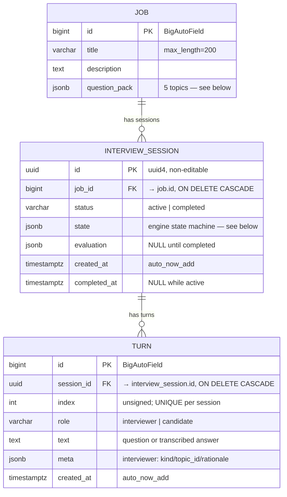
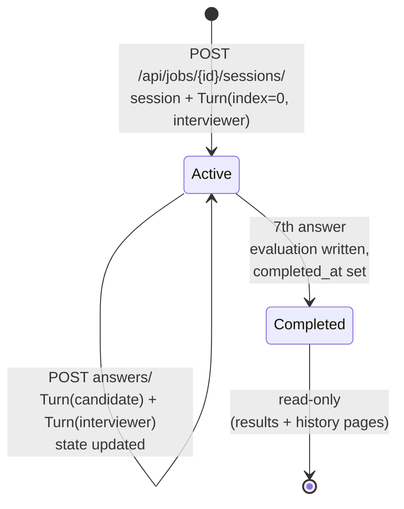

# Database Model

Three tables, one Django app (`interviews`), PostgreSQL. The schema is frozen —
see [CONTRACT.md](../CONTRACT.md). The whole interview state machine lives in
`InterviewSession.state`, so adding a new decision signal never requires a
migration.

## ER diagram



## Constraints and ordering

| Rule | Where |
|---|---|
| `UNIQUE (session_id, index)` — `unique_turn_index_per_session` | `Turn.Meta.constraints` |
| Default ordering `index ASC` — transcript order is a property of the table | `Turn.Meta.ordering` |
| `Job` deleted → its sessions and their turns cascade away | FK `on_delete=CASCADE` |
| `InterviewSession.id` is a UUID so room/results URLs aren't enumerable | `models.UUIDField(primary_key=True)` |
| Concurrent answer submissions serialize on the session row | `select_for_update()` in `engine.submit_answer` |

## JSON field shapes

These are the real contracts of the schema — everything the engine reasons
about is in here.

### `Job.question_pack`

Seeded by `python manage.py seed_jobs` (idempotent, 3 demo roles × 5 topics).
`{job_title}` in a question is substituted at render time.

```json
{
  "topics": [
    {
      "id": 1,
      "category": "behavioral",
      "question": "To start: tell me about a recent backend system you built as a {job_title}…",
      "signals": ["ownership", "system scope", "impact"]
    }
  ]
}
```

`category` is `behavioral` or `technical`. Each pack has exactly 5 topics —
the engine's 5-primary/2-follow-up budget assumes it.

### `InterviewSession.state`

```json
{
  "topic_cursor": 2,
  "followups_used": 1,
  "questions_asked": 4,
  "signals": [{"skill": "system design", "evidence": "described cache-aside pattern"}],
  "gaps": ["no mention of testing strategy"],
  "covered_topic_ids": [1, 2, 3]
}
```

| Key | Meaning |
|---|---|
| `topic_cursor` | Index into `question_pack.topics` of the topic being discussed |
| `followups_used` | 0–2; hard-capped by `MAX_FOLLOWUPS` |
| `questions_asked` | 1–7; the interview ends after the 7th answer |
| `signals` | Accumulated `{skill, evidence}` pairs, deduped on that pair |
| `gaps` | Accumulated unique strings |
| `covered_topic_ids` | Topic ids that have been asked as a primary |

### `InterviewSession.evaluation`

`NULL` while `status = "active"`. Written once, at completion.

```json
{
  "strengths": ["clear system design reasoning"],
  "concerns": ["limited testing depth"],
  "overall_score": 7,
  "summary": "Solid candidate with…"
}
```

If the evaluation LLM call fails, the engine stores
`FALLBACK_EVALUATION` (`overall_score: 0`, `summary: "Evaluation failed"`)
rather than leaving the session stuck in `active`.

### `Turn.meta`

- Candidate turns: `{}`.
- Interviewer turns: `{"kind": "primary"|"followup", "topic_id": int, "rationale": str}`.
  `rationale` is `"fallback"` when the LLM call failed and the pack question
  was served verbatim.

## Lifecycle of a session's rows



Turn indexes alternate strictly: even = interviewer, odd = candidate. A
completed session holds 14 turns (7 questions + 7 answers).

## Query notes

- `GET /sessions/` (history) is a constant 3 queries regardless of session
  count: jobs, sessions (with a `Count` annotation over interviewer turns),
  and one prefetch of turns. Word counts and talk ratio are computed in Python
  over the prefetched rows — see `views.session_history`.
- `GET /api/sessions/<uuid>/` uses `select_related("job")` plus one ordered
  turns query.

## Migrations

A single migration, `interviews/migrations/0001_initial.py`, creates all three
tables. `entrypoint.sh` runs `migrate --noinput` then `seed_jobs` on every boot,
so a fresh database is usable immediately.
